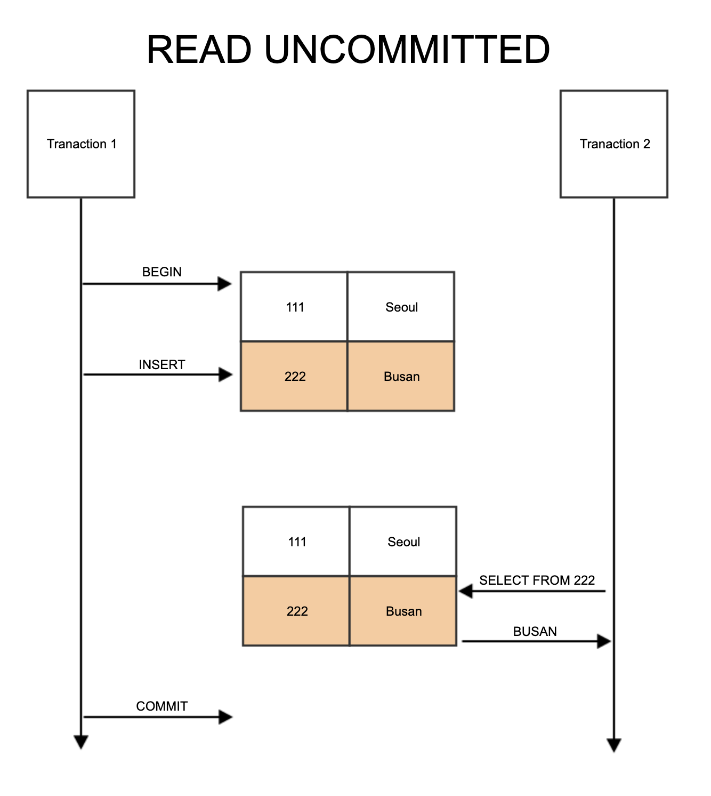
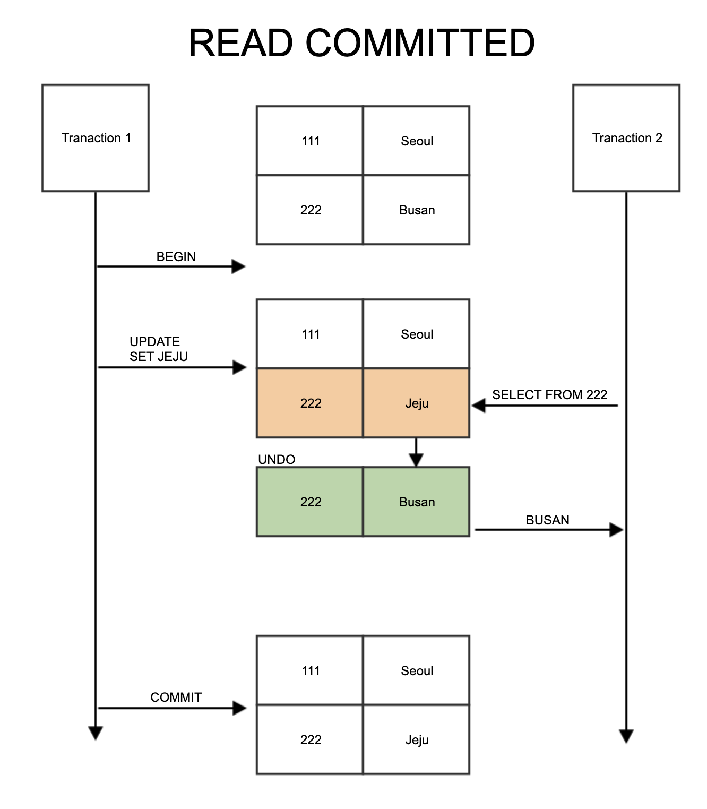
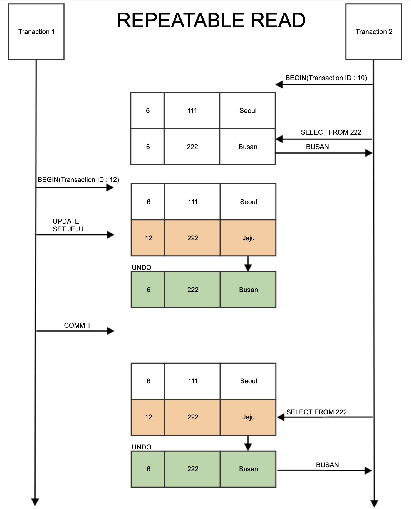

## 트랜잭션과 잠금

트랜잭션은 작업의 완전성을 보장해 주는 것이다. 즉, 논리적인 작업 셋을 모두 **완벽하게 처리하거나**, 처리하지 못할 경우에는 **원 상태로 복구**해서 작업의 일부만 적용되는 현상이 발생하지 않게 만들어주는 기능이다. : `원자성`

잠금(Lock)은 동시성을 제어하기 위한 기능이고, 트랜잭션은 데이터의 정합성을 보장하기 위한 기능이다. : `잠금은 데이터 정합성을 위한 수단이된다.`

격리 수준이라는 것은 하나의 트랜잭션 내에서 또는 여러 트랜잭션 간의 작업 내용을 어떻게 공유하고 차단할 것인지를 결정하는 레벨을 의미한다.

### 트랜잭션

**MySQL에서의 트랜잭션**

트랜잭션은 꼭 여러 개의 변경 작업을 수행하는 쿼리가 조합됐을 때만 의미 있는 개념은 아니다. 트랜잭션은 하나의 논리적인 작업 셋에 하나의 쿼리가 있든 두 개 이상의 쿼리가 있든 관계없이 논리적인 작업 셋 자체가 100% 적용되거나 (COMMIT을 실행했을 때) 아무것도 적용되지 않아야 함을 보장해주는 것이다.

```sql
-- id = PK
INSERT INTO example_table(id) values (3);
INSERT INTO example_table(id) values (1), (2), (3);
```

: 두 번째 쿼리 결과는 `1,2,3`이 아닌 `3` 이 나온다. -> 성공 또는 실패.

만약 트랜잭션이 없다면, 개발자는 어느 지점에서 실패했는지를 확인하고 업로드된 데이터들을 삭제해야 할 것이다.

**주의사항**

프로그램의 코드가 데이터베이스 커넥션을 가지고 있는 범위와 트랜잭션이 활성화돼 있는 프로그램의 범위를 최소화해야 한다는 것이다. 또한, 네트워크 작업이 있는 경우에는 반드시 트랜잭션에서 배제해야 한다. : `커넥션을 가지기 위해 대기하는 상황이 발생할수도 있기 때문!`

---

### MySQL 엔진의 잠금

MySQL에서 사용되는 잠금은 크게 **스토리지 엔진 레벨**과 **MySQL 엔진 레벨**로 나눌 수 있다.

MySQL 엔진은 스토리지 엔진을 제외한 나머지 부분으로 MySQL 엔진 레벨의 잠금은 모든 스토리지 엔진에 영향을 미치지만, 스토리지 엔진 레벨의 잠금은 스토리지 엔진 간 상호 영향을 미치지는 않는다.

- MySQL 엔진 레벨 잠금 : 글로벌 락, 테이블 락, 메타데이터 락, 네임드 락

**글로벌 락**

MySQL에서 제공하는 잠금 가운데 가장 범위가 크다. 일단 한 세션에서 글로벌 락을 획득하면 다른 세션에서 SELECT를 제외한 대부분의 DDL 문장이나 DML 문장을 실행하는 경우 글로벌 락이 해제될 때까지 해당 문장이 대기 상태로 남는다. 글로벌 락이 영향을 미치는 범위는 **MySQL 서버 전체**이다.

InnoDB 스토리지 엔진은 트랜잭션을 지원하기 때문에 일관된 테이터 상태를 위해 모든 데이터 변경 작업을 멈출 필요는 없다 : `Undo 로그가 있으니까!`

이를 위해 `백업 락`이 도입되었다. : `일반적인 테이블의 데이터 변경은 허용된다!`

**테이블 락**

테이블 락(Table Lock)은 개별 테이블 단위로 설정되는 잠금이며, 명시적으로는 `LOCK TABLES table_name [READ | WRITE]` 명령으로 특정 테이블의 락을 획득할 수 있다. 이후, `UNLOCK TABLES` 명령으로 잠금을 반납할 수 있다. : 명시적으로 테이블을 잠그는 작업은 글로벌 락과 동일하게 작업에 상당한 영향을 미치기 때문에 `특별한 상황이 아니면 애플리케이션에서 사용할 필요가 거의 없다.`

묵시적인 테이블 락은 테이블에 데이터를 변경하려는 쿼리를 실행하면 발생한다. MySQL 서버가 데이터가 변경되는 테이블에 잠금을 설정하고 데이터를 변경한 후, 즉시 잠금을 해제하는 형태로 사용된다. 즉, 묵시적인 테이블락은 쿼리가 실행되는 동안 자동으로 획득했다가 쿼리가 완료된 후 자동 해제된다. : `하지만 InnoDB 테이블의 경우 스토리지지 엔진 차원에서 레코드 기반의 잠금을 제공하기 때문에 단순 데이터 변경 쿼리로 인해 묵시적인 테이블 락이 설정되지는 않는다! -> DDL의 경우 설정.`

**네임드 락**

```sql
-- "mylock"이라는 문자열에 대해 잠금을 획득한다.
-- 이미 잠금을 사용 중이면 2초 동안만 대기한다. (2초 이후, 자동 잠금 해제)
mysql> SELECT GET_LOCK('mylock', 2)

-- "mylock"이라는 문자열에 대해 잠금이 설정돼 있는지 확인한다.
mysql> SELECT IS_FREE_LOCK('mylock')

-- "mylock"이라는 문자열에 대해 획득했던 잠금을 반납한다.
mysql> SELECT RELEASE_LOCK('lock');
```

상호 동기화를 처리해야 할 때, 또는 많은 레코드에 대해서 복잡한 요건으로 레코드를 변경하는 트랜잭션의 경우 유용하게 사용할 수 있다. 배치 프로그램처럼 한꺼번에 많은 레코드를 변경하는 쿼리는 자주 데드락의 원인이 되곤 한다.

**동일 데이터를 변경하거나, 참조하는 프로그램끼리 분류**해서 네임드 락을 걸고 쿼리를 실행하면 아주 간단히 해결할 수 있다.

**메타데이터 락**

메타데이터 락(Metadata Lock)은 데이터베이스 객체(테이블/뷰)의 이름이나 구조를 변경하는 경우에 획득하는 잠금이다. : `예시 코드를 통해 직접 경험해보자.`

```sql
mysql> CREATE TABLE access_log (
    id BIGINT NOT NULL AUTO_INCREMENT,
    client_id INT UNSIGNED,
    ...
    PRIMARY KEY(id)
);
```

해당 테이블의 구조를 변경할 때 단순 DDL을 이용해서 변경하게 된다면, 데이터가 많다면 언두 로그의 증가와 누적된 버퍼의 크기 등 고민해야 할 문제가 많다. 또한, **DDL은 단일 스레드로 작동하기 때문에 많은 시간이 소모될 것이다.** 따라서 새로운 구조의 테이블을 생성하고 여러 개의 스레드로 빠르게 복사한다.

```sql
mysql > CREATE TABLE access_log_new (
    ...
)

mysql_thread1 > INSERT INTO access_log_new SELECT * FROM access_log WHERE id >= 0 AND id < 10000;

mysql_thread2 > INSERT INTO access_log_new SELECT * FROM access_log WHERE id >= 10000 AND id < 20000;

...
```

나머지 데이터는 트랜잭션과 테이블 잠금, RENAME TABLE 명령으로 응용 프로그램의 중단 없이 실행 (중단이 없다기 보다는, **락을 갖는 시간을 최소화**)

```sql
mysql > SET autocommit = 0;

-- 작업 대상 테이블 2개에 대해 테이블 쓰기 락 획득.
mysql> LOCK TABLES access_log WRITE, access_log_new WRITE;


-- 남은 데이터 복사.
mysql > SELECT MAX(id) as @MAX_ID FROM access_log;
mysql > INSERT access_log_new SELECT * FROM access_log WHERE pk > @MAX_ID;
mysql > commit;

-- 새로운 테이블로 데이터 복사가 완료되면, RENAME
mysql > RENAME access_log to access_log_old, access_log_new TO access_log
mysql > UNLOCK TABLES;
```

---

### InnoDB 스토리지 엔진 잠금

**레코드 락**  
레코드 자체만을 잠그는 것을 레코드 락(Record lock, Record only lock)이라고 하며, 다른 상용 DBMS의 레코드 락과 동일한 역할을 한다. 한 가지 중요한 차이는 InnoDB 스토리지 엔진은 레코드 자체가 아니라 **인덱스의 레코드를 잠근다는 점**이다.

InnoDB에서는 대부분 보조 인덱스(기본키가 아닌 열의 인덱스)를 이용한 변경 작업은 넥스트 키 락(Next key lock) 또는 갭 락(Gap lock)을 사용하지만 **프라이머리 키 또는 유니크 인덱스에 의한 변경 작업에서는 레코드 자체에만 락**을 건다.

**갭 락**  
갭 락은 레코드 자체가 아니라 **레코드 바로 인접한 레코드 사이의 간격만을 잠그는 것**을 의미한다. 갭 락의 역할은 **레코드와 레코드 사이의 간격에 새로운 레코드가 생성(INSERT)되는 것**을 제어하는 것이다.
: `넥스트 락의 일부로 자주 사용됨!`

**넥스트 키 락**  
레코드 락과 갭 락을 합쳐 놓은 형태의 잠금을 넥스트 키 락(Next key lock)이라고 한다.
InnoDB의 갭 락이나 넥스트 키 락은 바이너리 로그에 기록되는 쿼리가 레플리카 서버에서 실행될 때 소스 서버에서 만들어낸 결과와 동일한
결과를 만들어내도록 보장하는 것이 주목적이다. : `즉, 중간에 데이터가 삽입되지 않도록 보장하기 위해서 (REPEATABLE READ)`

```sql
-- age 가 인덱스인 경우.

-- Transaction A
SELECT * FROM users WHERE age BETWEEN 20 AND 30

-- Transaction B : 락에 걸림.
INSERT INTO users (age) VALUES (25)
```

**자동 증가 락**  
MySQL에서는 자동 증가하는 숫자 값을 추출하기 위해 `AUTO_INCREMENT`라는 컬럼 속성을 제공한다.
`AUTO_INCREMENT` 컬럼이 사용된 테이블에 동시에 여러 레코드가 INSERT되는 경우, 저장되는 각 레코드는
중복되지 않고 저장된 순서대로 증가하는 일련번호 값을 가져온다. : `AUTO_INCREMENT 락은 테이블 당 하나만 존재하므로,
동시에 INSERT 쿼리가 실행되더라도, 하나의 쿼리가 락을 걸면 나머지 쿼리는 기다려야 한다.`

---

### 인덱스와 잠금

InnoDB의 잠금은 레코드를 잠그는 것이 아니라 **인덱스를 잠그는 방식으로 처리된다.**
즉, 변경해야 할 레코드를 찾기 위해 검색한 인덱스의 레코드를 모두 락을 걸어야 한다.

```sql
-- first_name 컬럼만 인덱스인 경우.
SELECT COUNT(*) FROM employees WHERE first_name = 'Georgi'; --253
UPDATE employees SET hire_date = now() where first_name = 'Georgi' AND last_name = 'Klassen;
```

위의 경우, 활용할 수 있는 인덱스가 `first_name` 컬럼 하나뿐이므로,
235건의 레코드에 대해 모두 잠금을 걸게 된다. : `그럼, 수정에 활용되는 컬럼은 최대한 인덱스(인덱스 자체의 개수는 최소화하면서)를 활용해야 겠다!`

---

## MySQL의 격리 수준

트랜잭션의 격리 수준(isolation level)이란 여러 트랜잭션이 동시에 처리될 때, 특정 트랜잭션이
**다른 트랜잭션에서 변경하거나 조회하는 데이터를 볼 수 있게 허용할지 말지를 결정**하는 것이다.
격리 수준은 크게 `READ UNCOMMITED`, `READ COMMITED`, `REPEATABLE READ`, `SERIALIZABLE`
4가지로 나뉜다.

: `트랜잭션의 격리 수준이 높아지게 된다면, 동시 처리 성능도 떨어지는 것이 일반적! 다만, SERIALIZABLE 격리 수준이
아니라면 크게 성능의 개선이나 저하가 발생하지 않는다`

### READ UNCOMMITED

각 트랜잭션의 변경 내용이 **COMMIT이나 ROLLBACK 여부에 상관 없이 다른 트랜잭션에서 보인다**.
: `만약, B 트랜잭션이 이전에 A 트랜잭션의 데이터를 읽은 후, A 트랜잭션이 롤백된다면 데이터 정합성 보장이 어려울거야..`



이처럼 어떤 트랜잭션에서 처리한 작업이 완료되지 않았는데도 다른 트랜잭션에서 볼 수 있는 현상을
더티 리드(Dirty read)라 하고, 더티 리드가 허용되는 격리 수준이 READ UNCOMMITED다. : `위의 이유로 권장되지 않음!`

### READ COMMITTED

오라클 DBMS에서 기본적으로 사용되는 격리 수준이며, 온라인 서비스에서 가장 많이 선택되는 격리 수준이다.
이 레벨에서는 더티 리드(Dirty read) 같은 현상은 발생하지 않는다. **어떤 트랜잭션에서 데이터를 변경했더라도
COMMIT이 완료된 데이터만 다른 트랜잭션에서 조회할 수 있기 때문!**



READ COMMITTED 격리 수준에서도 `NON-REPEATABLE READ`가 발생하는 **부정합의 문제**가 있다.

Transaction 1이 특정 행을 업데이트 하고 커밋되기 전에 Transaction 2가 해당 행을 읽으면 업데이트 되기 전의 값을 읽을 것이다. 하지만, 이후 Transaction 1이 커밋되고 다시 Transaction 2가 해당 행을 읽으면, 업데이트 된 값을 읽게 되는 것이다! : `이는 단건 조회보다는 범위 탐색과 Insert 와 같은 경우에 더 큰 문제가 발생할 듯!`

- READ COMMITTED 격리 수준에서는 트랜잭션 내에서 실행되는 SELECT 문장과 트랜잭션 외부에서 실행되는 SELECT 문장의 차이가 거의 없다.
- 해당 격리수준을 통해서, JPA의 낙관적 락 방식을 구현할 수 있을 것 같다!

### REPEATABLE READ

MySQL의 InnoDB 스토리지 엔진에서 **기본적으로 사용되는 격리 수준**이다. 바이너리 로그를 가진 MySQL 서버에서는 최소 `REPEATABLE READ` 격리 수준 이상을 사용해야 한다. InnoDB 스토리지 엔진은 트랜잭션이 Rollback 될 가능성에 대비해 변경되기 전 레코드를 언두(Undo) 공간에 백업해두고 실제 레코드 값을 변경한다. : `MVCC를 위해!`



### SERIALIZABLE

가장 단순한 격리 수준이면서, 동시에 가장 엄격한 격리 수준이다. 그만큼 동시 처리 성능도 다른 트랜잭션 격리 수준보다 떨어진다. InnoDB 테이블에서 기본적으로 **순수한 SELECT 작업은 아무런 레코드 잠금도 설정되지 않고 실행**된다.

하지만, 트랜잭션의 격리 수준이 SERIALIZABLE로 설정되면 읽기 작업도 공유 잠금(읽기 잠금)을 획득해야만 하며, 동시에 다른 트랜잭션은 그러한 레코드를 변경하지 못하게 된다.
