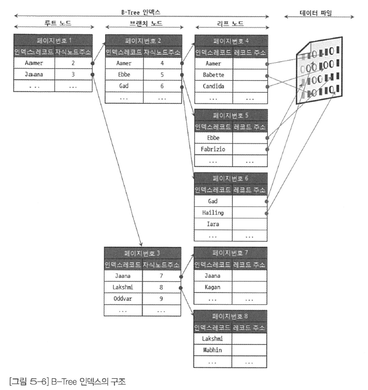
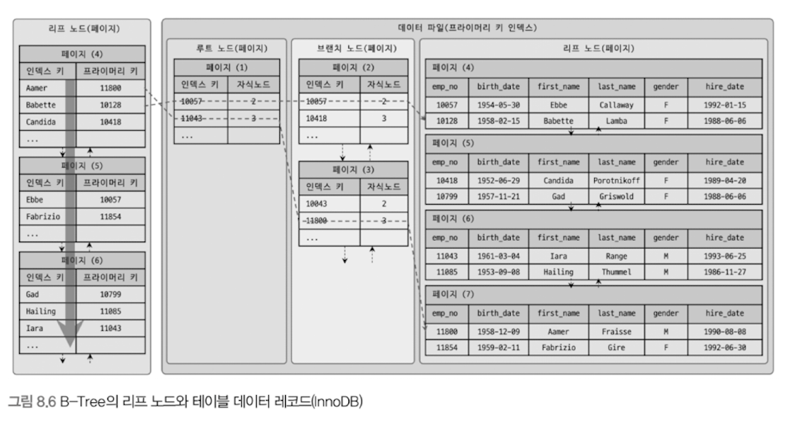
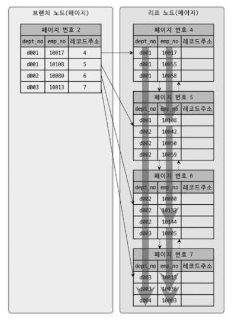

## 인덱스

### 디스크 읽기 방식

**랜덤 I/O와 순차 I/O**

랜덤 I/O라는 표현은 하드 디스크 드라이브의 플래터(원판)를 돌려서 읽어야 할 데이터가 저장된 위치로 디스크 헤더를 이동시킨 다음 데이터를 읽는 것을 의미하는데, 사실 순차 I/O 또한 이 작업 과정은 같다.

Ex : 순차 I/O는 3개의 페이지를 디스크에 기록하기 위해 1번 시스템 콜을 요청하는 것에 비해 랜덤 I/O는 3번의 시스템 콜을 요청하게 되었다.

사실 쿼리를 튜닝해서 랜덤 I/O를 순차 I/O로 바꿔서 실행할 방법은 그다지 많지 않다. 일반적으로 쿼리를 튜닝하는 것은 랜덤 I/O 자체를 줄여주는 것이 목적이라고 할 수 있다. **여기서 랜덤 I/O를 줄인다는 것은 쿼리를 처리하는 데 꼭 필요한 데이터만 읽도록 쿼리를 개선**하는 것을 의미한다.

### 인덱스란?

DBMS에서 데이터베이스 테이블의 모든 데이터를 검색해서 원하는 결과를 가져오려면 시간이 오래 걸린다. 그래서 **컬럼(또는 컬럼들)의 값과 해당 레코드가 저장된 주소**를 키와 값의 쌍으로 삼아 인덱스를 만들어 두는 것이다. 또한 최대한 빠르게 찾아갈 수 있게 인덱스도 **칼럼의 값을 주어진 순서로 미리 정렬해서 보관**한다.

SortedList 자료 구조는 데이터가 **저장될 때마다 항상 값을 정렬해야 하므로 저장하는 과정이 복잡하고 느리지만, 이미 정렬되어 이어서 아주 빨리 원하는 값을 찾아올 수 있다**. : DBMS의 인덱스 또한 Insert, Update, Delete 처리가 느려진다. **대신 Select 의 처리가 매우 빨라진다.**

인덱스를 역할별로 구분해 본다면 **프라이머리 키(Primary key)와 보조 키(Secondary key)**로 구분할 수 있다.

- 프라미어미 키는 해당 레코드를 대표하는 칼럼의 값으로 만들어진 인덱스를 의미. 테이블에서 해당 레코드를 식별할 수 있는 기준값이 되며, NULL과 중복을 허용하지 않는다.

인덱스를 알고리즘 별로 구분할 경우, 대표적으로 **B-Tree 인덱스와 Hash 인덱스**로 구분할 수 있다.

- Hash 인덱스 알고리즘은 칼럼의 값으로 해시값을 계산하여 인덱싱하는 알고리즘으로 매우 빠른 검색을 지원한다. 다만, 값을 변형해서 인덱싱하므로 값의 일부만 검색하거나 범위를 검색하는 경우 해시 인덱스를 사용할 수 없다.

데이터의 중복 허용 여부로 분류하면 유니크 인덱스(Unique)와 유니크하지 않은 인덱스(Non Unique)로 구분할 수 있다. 인덱스가 유니크한지 아닌지는 단순히 같은 값이 1개만 존재하는지 1개 이상 존재할 수 있는지를 의미하지만, 실제 DBMS의 쿼리를 실행해야 하는 옵티마이저에게는 상당히 중요한 문제가 된다.

: **유니크 인덱스에 대해 동등 조건(=)으로 검색한다는 것은 항상 1건의 레코드만 찾으면 더이상 탐색을 하지 않아도 된다는 것을 의미하기 때문에!**

### B-Tree 인덱스

B-Tree의 "B"는 "Binary(이진)"의 약자가 아니라 "Balanced"를 의미한다.

B-Tree는 칼럼의 원래 값을 변형시키지 않고, 인덱스 구조체 내에서는 항상 정렬된 상태로 유지한다.

**구조 및 특성**
B-Tree는 트리 구조의 최상위에 하나의 **루트 노드(Root node)**가 존재하고 그 하위에 자식 노드가 붙어 있는 형태다. 트리 구조의 가장 하위에 있는 노드를 **리프 노드(leaf node)**라 하고, 트리 구조에서 루트 노드도 아니고 리프 노드도 아닌 중간의 노드를 **브랜치 노드(Branch node)**라고 한다. 데이터베이스에서 인덱스와 실제 데이터가 저장된 데이터는 따로 관리되는데, **인덱스의 리프 노드는 항상 실제 데이터 레코드를 찾아가기 위한 주솟값**을 가지고 있다.



(출처 : https://velog.io/@jsj3282/14.-B-Tree-%EC%9D%B8%EB%8D%B1%EC%8A%A4)

인덱스의 키 값은 모두 정렬되어 있지만, 데이터 파일의 레코드는 정렬돼 이씨 않고 임의의 순서로 저장돼 있다. 많은 사람들이 데이터 파일의 레코드는 INSERT된 순서대로 저장되는 것으로 생각하지만 그렇지 않다. : `레코드가 삭제되어 빈 공간이 생기면 그 다음의 INSERT는 빈 공간을 채워야 공간을 활용할 수 있기 때문에!`

인덱스는 테이블의 키 칼럼만 가지고 있으므로 나머지 칼람을 읽으려면 데이터 파일에서 해당 레코드를 찾아야 한다. 이를 위해 **인덱스의 리프 노드는 데이터 파일에 저장된 레코드의 주소**를 가진다.



InnoDB 스토리지 엔진을 사용하는 테이블에서는 프라이머리 키가 ROWID의 역할을 한다. 두 스토리지 엔진의 인덱스에서 가장 큰 차이점은 세컨더리 인덱스를 통해 데이터 파일의 레코드를 찾아가는 방법에 있다. **MyISAM 테이블은 세컨더리 인덱스가 물리적인 주소를 가지는 반면 InnoDB 테이블은 프라이머리 키를 주소처럼 사용하기 때문에 논리적인 주소를 가진다고 볼 수 있다.**

그래서 InnoDB 테이블에서 인덱스를 통해 레코드를 읽을 때는 인덱스에 저장돼 있는 프라이머리 키 값을 이용해 프라이머리 키 인덱스를 한 번 더 검색한 후, 프라이머리 키 인덱스의 리프 페이지에 저장돼 있는 레코드를 읽는다. **즉, InnoDB 스토리지 엔진에서는 반드시 프라이머리 키를 저장하고 있는 B-Tree를 다시 한번 더 검색해야 한다.**
: `MyISAM은 인덱스를 통해 바로 데이터에 접근할 수 있는데, InnoDB는 왜 이 방식을 채택하는걸까?`

### B-Tree 인덱스 키 추가 및 삭제

**인덱스 키 추가**

새로운 키 값이 B-Tree에 저장될 때 테이블의 스토리지 엔진에 따라 새로운 키 값이 즉시 인덱스에 저장될 수도 있고 그렇지 않을 수도 있다. B-Tree에 저장될 때는 저장될 키 값을 이용해 B-Tree 상의 적절한 위치를 검색해야 한다. 저장될 위치가 결정되면 레코드의 키 값과 대상 레코드의 주소 정보를 B-Tree의 리프 노드에 저장한다.

리프노드가 꽉 차서 더는 저장할 수 없을 때는 리프 노드가 분리되어야 하는데, 이는 상위 브랜치 노드까지 처리의 범위가 넓어진다. 이로인해 쓰기 작업(새로운 키를 추가하는 작업)에 비용이 많이 드는 것으로 알려졌다.

**인덱스 추가로 인한 대략적인 비용 계산** : 레코드 추가 작업 비용 1 & 인덱스에 키를 추가하는 작업 비용 1.5

Ex : 일반적으로 테이블에 인덱스가 3개가 있다면, **비용 : 1 + 1.5 \* 3**

InnoDB 스토리지 엔진은 INSERT 시 발생하는 인덱스 추가 작업을 지연시켜 나중에 처리할 수 있다. (Unique & Primary Key는 제외).
: `가능하면 단순 인덱스를 거는게 삽입 성능을 조금이라도 증가시킬 수 있을 것 같다!`

**인덱스 키 삭제**

B-Tree의 키 값이 삭제되는 경우, 해당 키 값이 저장된 B-Tree의 리프 노드를 찾아서 그냥 **삭제 마크만 하면 작업이 완료**된다. 이렇게 삭제 마킹된 인덱스 키 공간은 계속 그대로 방치하거나 재활용할 수 있다. 인덱스 키 삭제로 인한 마킹 작업 또한 디스크 쓰기가 필요하므로 이 작업 역시 디스크 I/O가 필요한 작업이다.

**인덱스 키 변경**

인덱스의 키 값은 그 값에 따라 저장될 리프 노드의 위치가 결정되므로 B-Tree의 키 값이 변경되는 경우에는 단순히 인덱스상의 키 값만 변경하는 것은 불가능하다. **B-Tree의 키 값 변경 작업은 먼저 키 값을 삭제한 후, 다시 새로운 키 값을 추가하는 형태로 처리된다.** : `마찬가지로, 유니크 제약 조건이 있는 컬럼을 자주 수정하는 것은 좋지 않을듯하다!`

---

### 인덱스 키 검색

INSERT, UPDATE, DELETE 작업을 할 때 인덱스 관리에 따르는 추가 비용을 감당하면서 인덱스를 구축하는 이유는 바로 **빠른 검색**을 위해서다. 인덱스를 검색하는 작업은 B-Tree의 루트 노드부터 시작해 브랜치 노드를 거쳐 최종 리프 노드까지 이동하면서 비교 작업을 수행하는데, 이 과정을 **트리 탐색**이라고 한다.

인덱스 트리 탐색은 SELECT 뿐만 아니라 UPDATE 나 DELETE를 처리하기 위해 항상 레코드를 먼저 검색해야 할 경우에도 사용된다.

B-Tree 인덱스를 이용한 검색은 100% 일치 (=), 값의 앞부분만 일치하는 경우, 부등호 비교 조건(<, >)에서 사용할 수 있다.

```sql
SELECT * FROM users WHERE name = 'Alice';  -- 100% 일치
SELECT * FROM users WHERE name LIKE 'Ali%'; -- 앞부분 일치
SELECT * FROM users WHERE name > 'Bob';  -- 부등호 비교
```

인덱스를 이용한 검색에서 중요한 사실은 인덱스의 키 값에 변형이 가해진 후 비교 되는 경우에는 절대 B-Tree의 빠른 검색 기능을 사용할 수 없다는 것이다. 따라서 함수나 연산을 수행한 결과로 정렬한다거나 검색하는 작업은 B-Tree의 장점을 이용할 수 없으므로 주의해야 한다.

**예시**

```sql
SELECT * FROM users WHERE age + 1 = 30;  -- (인덱스 사용 불가)
SELECT * FROM users WHERE age = 29;  -- Good!
```

InnoDB 스토리지 엔진에서 인덱스는 더 특별한 의미가 있다. InnoDB 테이블에서 지원하는 **레코드 잠금이나 넥스트 키락(갭락)이 검색을 수행한 인덱스를 잠근 후, 테이블의 레코드를 잠그는 방식**으록 구현돼 있다. 따라서 UPDATE나 DELETE 문장이 실행될 때 테이블에 적절히 사용할 수 있는 인덱스가 없으면, 불필요하게 많은 레코드를 잠근다. : `인덱스 설계가 중요함!`

---

### B-Tree 인덱스 사용에 영향을 미치는 요소

B-Tree 인덱스는 인덱스를 구성하는 **칼럼의 크기와 레코드의 건수**, 그리고 **유니크한 인덱스 키 값의 개수** 등에 의해 검색이나 변경 작업의 성능이 영향을 받는다.

**인덱스 키 값의 크기**

InnoDB 스토리지 엔진은 디스크에 데이터를 저장하는 가장 기본 단위를 페이지(Page) 또는 블록(Block)이라고 하며, 디스크의 모든 읽기 및 쓰기 작업의 최소 작업 단위가 된다. 또한 페이지는 InnoDB 스토리지 엔진의 버퍼 풀에서 데이터를 버퍼링하는 기본 단위이기도 하다. 인덱스도 결국은 페이지 단위로 관리된다.

이진(Binary) 트리는 각 노드가 자식 노드를 2개만 가지는데, DBMS의 B-Tree가 이진 트리라면 인덱스 검색이 상당히 비효율적일 것이다.

: `자식 노드로 진행될때마다 절반씩 탐색 범위가 감소되므로! 만약 자식 노드가 3개라면, 탐색범위가 1/3 으로 줄어든다!`

일반적으로 DBMS의 B-Tree는 자식 노드의 개수가 가변적인 구조다. 그러면 MySQL의 B-Tree는 자식 노드를 몇 개까지 가지는지 궁금할 것이다. 그것은 바로 인덱스의 페이지 크기와 키 값의 크기에 따라 결정된다. : `InnoDB 스토리지 엔진의 페이지 기본 값은 16KB`

인덱스의 키가 16Byte 라고 가정하고, 자식 노드 주소를 평균 12Byte로 가정하자. 이 경우, 하나의 인덱스 페이지(16KB)에 몇 개의 키를 저장할 수 있을까?

: `(16 * 1024) / (16 + 12) = 585개.` 최종적으로 이 경우는 자식 노드를 585개 가질 수 있는 B-Tree가 되는 것이다.

인덱스 키 값을 2배 늘어난 32Byte로 가정하자. => `16 * 1024 / (32 + 12) = 372개.` 만약, 레코드 500개를 읽어야 한다면 전자는 인덱스 페이지 한번으로 **해결될 수도** 있지만, **후자는 최소 2번 이상 읽어야 한다.** 결국 인덱스를 구성하는 키 값의 크기가 커지면 디스크로부터 읽어야 하는 횟수가 늘어나고, 그만큼 느려진다는 것을 의미한다.

또한, 인덱스 키 값의 길이가 길어진다는 것은 전체적인 인덱스의 크기가 커진다는 것을 의마한다. 이는 인덱스를 캐시해두는 InnoDB 버퍼 풀에 캐시해둘 수 있는 레코드 수가 줄어들게 되는 영향을 미치게된다.

### B-Tree 깊이

B-Tree 인덱스의 깊이(Depth)는 상당히 중요하지만 직접 제어할 방법은 없다. 인덱스 키 값의 평균 크기가 늘어나면 어떤 현상이 추가로 더 발생하는지 알아보자. 만약 B-Tree 깊이가 3인 경우 최대 몇 개의 키 값을 가질 수 있는지 비교해보자.

- 키 값이 16바이트인 경우. 585개 \*\* 3(depth = 3) = 최대 2억.
- 키 값이 32바이트인 경우. 372개 \*\* 3 = 5천만.

B-Tree의 깊이는 MySQL에서 값을 검색할 때 몇 번이나 랜덤하게 디스크를 읽어야 하는지와 직결되는 문제다. **결론적으로 인덱스 키 값의 크기가 커지면 커질수록 하나의 인덱스 페이지가 담을 수 있는 인덱스 키 값의 개수가 적어지고, 그 때문에 같은 레코드 건수라 하더라도 B-Tree의 깊이(Depth)가 깊어져서 디스크 읽기가 더 많이 필요**하게 된다는 것을 의미한다.

따라서 인덱스 키 값의 크기는 가능하면 작게 만드는 것이 좋다는 것을 강조하기 위함이고, 실제로는 아무리 대용량 데이터베이스라도 B-Tree의 깊이(Depth)가 5단계 이상까지 깊어지는 경우는 흔치않다.

### 선택도 (기수성)

인덱스에서 선택도(Selectivity) 또는 기수성(Cardinality)은 거의 같은 의미로 사용되며, 모든 인덱스 키 값 가운데 유니크한 값의 수를 의미한다.

- 전체 인덱스 키 값은 100개인데, 그 중에서 유니크한 값의 수는 10개라면 기수성은 10이다.

인덱스 키 값 가운데 중복된 값이 많아지면 많아질수록 기수성은 낮아지고 동시에 선택도 또한 떨어진다. 인덱스는 선택도가 높을수록 검색 대상이 줄어들기 때문에 그만큼 빠르게 처리된다.
: `그래서 PK, Unique Key 가 검색에서 빠른거구나!`

**참고** : 선택도가 좋지 않다고 하더라도 정렬이나 그루핑과 같은 작업을 위해 인덱스를 만드는 것이 훨씬 나은 경우도 많다. 인덱스가 항상 검색에만 사용되는 것은 아니므로 여러 가지 용도를 고려해 적절히 인덱스를 설계할 필요가 있다. => `마치 카테고리같은 느낌..!`

```sql
SELECT *
FROM tb_test -- country 컬럼에만 인덱스가 있는 경우.
WHERE country = 'KOREA' AND city = 'SEOUL';
```

- 케이스 A : country 컬럼의 유니크한 값의 개수가 10개
- 케이스 B : country 컬럼의 유니크한 값의 개수가 1000개

데이터가 10,000개 있다는 가정하에 케이스 A는 1건의 레코드를 위해 쓸모없는 999건의 레코드를 더 읽지만, 케이스 B는 9건의 레코드만 더 읽으면 된다.

두 케이스의 테이블에서 똑같은 쿼리를 실행해 똑같은 결과를 받더라도, 두 쿼리가 처리되기 위해 MySQL 서버가 수행한 작업 내용은 매우 크다는 것을 알 수 있다. 이처럼 **인덱스에서 유니크한 값의 개수는 인덱스나 쿼리의 효율성에 큰 영향**을 미친다.

**읽어야 하는 레코드의 건수**

**인덱스를 통해 테이블의 레코드를 읽는 것은 인덱스를 거치지 않고 바로 테이블의 레코드를 읽는 것보다 높은 비용**이 드는 작업이다. 테이블에 레코드가 100만 건이 저장돼 있는데, 그중에서 50만 건을 읽어야 하는 쿼리가 있다고 가정해 보자.

일반적인 DBMS의 옵티마이저에서는 **인덱스를 통해 레코드 1건을 읽는 것이 테이블에서 직접 레코드 1건을 읽는 것보다 4~5배 정도 비용이 많이 드는 작업**인 것으로 예측한다.

즉, 인덱스를 통해 읽어야 할 레코드의 건수가 전체 테이블 레코드의 20~25%를 넘어서면 인덱스를 이용하지 않고 테이블을 모두 직접 읽어서 필요한 레코드만 가려내는(필터링) 방식으로 처리하는 것이 효율적이다.

위의 50만 건을 읽는 작업은 인덱스의 손익 분기점인 20~25%보다 훨씬 크기 때문에 직접 테이블을 처음부터 끝까지 읽어서 처리할 것이다. : `강제로 인덱스를 사용하도록 힌트를 추가해도 성능상 얻을 수 있는 이점이 없다는 것!`

### B-Tree 인덱스를 통한 데이터 읽기

어떤 경우에 인덱스를 사용하게 유도할지, 또는 사용하지 못하게 할지 판단하려면 스토리지 엔진이 어떻게 인덱스를 이용(경유)해서 실제 레코드를 읽어 내는지 알아야 한다.

**인덱스 레인지 스캔**

인덱스 레인지 스캔은 인덱스의 접근 방법 가운데 가장 대표적인 접근 방식으로, 뒤에서 설명할 나머지 두 가지 접근 방식보다는 빠른 방법이다. 해당 책에서는 인덱스를 통해 레코드를 한 건만 읽는 경우와 한 건 이상을 읽는 경우를 구분하지 않고 **인덱스 레인지 스캔**이라고 표현한다!

```sql
mysql > SELECT * FROM employees WHERE first_name BETWEEN 'Ebbe' AND 'Gad';
```


인덱스 레인지 스캔은 검색해야 할 **인덱스의 범위가 결정됐을 때** 사용하는 방식이다. 검색하려는 값의 수나 검색 결과 레코드 건수와 관계없이 레인지 스캔이라고 표현한다. 위의 그림처럼 루트 노드에서부터 비교를 시작해 브랜치 노드를 거치고 최종적으로 리프 노드까지 찾아 들어가야만 비로소 필요한 **레코드의 시작 지점**을 찾을 수 있다. : `시작위치를 찾으면 마지막 범위가 나올때까지 리프 노드의 레코드만 순서대로 읽으면 된다!`


이전 그림은 실제 인덱스만을 읽는 경우를 보여준다. 하지만 B-Tree 인덱스의 리프 노드를 스캔하면서 실제 데이터 파일의 레코드를 읽어 와야 하는 경우도 많다. (바로 위 그림)

중요한 것은 어떤 방식으로 스캔하든 관계없이, 해당 인덱스를 구성하는 **칼럼의 정순 또는 역순으로 정렬된 상태로 레코드를 가져온다는 것!** : `인덱스 자체의 정렬 특성 때문!`

또 한 가지 중요한 것은 인덱스의 리프 노드에서 검색 조건에 일치하는 건들은 데이터 파일에서 레코드를 읽어오는 과정이 필요하다는 것. **이때 리프 노드에 저장된 레코드 주소로 데이터 파일의 레코드를 읽어오는데, 레코드 한 건, 한 건 단위로 랜덤 I/O가 한 번씩 일어난다.**

그래서 인덱스를 통해 읽어야 할 데이터 레코드가 20~25%를 넘으면 인덱스를 통한 읽기보다 테이블의 데이터를 직접 읽는 것이 더 효율적인 처리 방식이 된다.

- **인덱스 레인지 스캔 과정**

1. 인덱스에서 조건을 만족하는 값이 저장된 위치를 찾는다.
2. 1번에서 탐색된 위치부터 필요한 만큼 인덱스를 차례대로 쭉 읽는다. (리프노드들을)
3. 2번에서 읽어 들인 인덱스 키와 레코드 주소를 이용해 레코드가 저장된 페이지를 가져오고, 최종 레코드를 읽어온다.

쿼리가 필요로 하는 데이터에 따라 3번 과정은 필요하지 않을 수도 있는데, 이를 **커버링 인덱스**라고 한다. 커버링 인덱스로 처리되는 쿼리는 디스크의 레코드를 읽지 않아도 되기 때문에 랜덤 읽기가 상당히 줄어들고 성능은 그만큼 빨라진다.
: `Ex : 제목을 인덱스로 한 뒤, 제목만 Select 하는 쿼리`

**인덱스 풀 스캔**

인덱스 레인지 스캔과 마찬가지로 인덱스를 사용하지만 인덱스 레인지 스캔과는 달리 **인덱스의 처음부터 끝까지 모두 읽는 방식**을 풀 스캔이라고 한다.

일반적으로 인덱스의 크기는 테이블의 크기보다 작으므로 직접 테이블을 읽는 것보다는 인덱스만 읽는 것이 효율적이다. **쿼리가 인덱스에 명시된 컬럼만으로 조건을 처리할 수 있는 경우**, 주로 이 방식이 사용된다.

**루스 인덱스 스캔**

루스 인덱스 스캔이란 말 그대로 느슨하게 또는 듬성듬성하게 인덱스를 읽는 것을 의미한다. 인덱스 레인지 스캔과 비슷하게 작동하지만 중간에 필요치 않은 인덱스 키 값은 무시(SKIP)하고 다음으로 넘어가는 형태로 처리한다. 일반적으로 GROUP BY 또는 집합 함수 가운데 MAX() 또는 MIN() 함수에 대해 최적화를 하는 경우에 사용된다.

```sql
-- dept_no , emp_no 라는 두 개의 컬럼으로 인덱스가 생성되 있는 경우.
-- 그리고, (dept_no, emp_no) 조합으로 정렬까지 되어 있다.
SELECT dept_no, MIN(emp_no)
FROM dept_emp
WHERE dep_no BETWEEN 'd002' AND 'd004'
GROUP BY dept_no;
```


**인덱스 스킵 스캔**

```sql
ALTER TABLE employees
ADD INDEX ix_gender_birthday (gender, birth_date);

-- 인덱스를 사용 못하는 쿼리.
SELECT * FROM employees WHERE birth_date >= '1965-02-01';

-- 인덱스를 사용할 수 있는 쿼리.
SELECT * FROM employees WHERE gender ='M' AND birth_date >= '1965-02-01';
```

첫 번째 쿼리에 대해서 MySQL 8.0 에서는 인덱스 스킵 스캔을 통해 gender 컬럼을 건너뛰어서 birth_date 컬럼만으로도 인덱스 검색이 가능하게 해주는 기능이 도입되었다.


- WHERE 조건절에 조건이 없는 인덱스의 선행 칼럼의 유니크한 **값의 개수가 적어야 함**. : `여기서는 gender`
- 쿼리가 인덱스에 존재하는 컬럼만으로 처리 가능해야 함

### 다중 칼럼(Multi-column) 인덱스

실제 서비스용 데이터베이스에서는 **2개 이상의 칼럼을 포함하는 인덱스**가 더 많이 사용된다.
두 개 이상의 칼럼으로 구성된 인덱스를 다중 칼럼 인덱스(또는 복합 칼럼 인덱스)라고 하며,
또한 2개 이상의 칼럼이 연결됐다고 해서 'Concatenated Index'라고도 한다.



해당 그림에서 중요한 것은 **두 번째 칼럼의 정렬은 첫 번째 칼럼에 의존해서 졍렬**돼 있다는 것이다. 즉, 두 번째 칼럼의 정렬은 첫 번째 컬럼이 동일한 경우에만 의미가 있다. : `그렇다면, 복합 인덱스를 걸때는 두 번째 컬럼을 단독으로 사용하여 조회하는 경우에는 지양하는게 좋겠다!`

다중 컬럼 인덱스에서는 인덱스 내에서 각 컬럼의 위치(순서)가 상당히 중요하며, 그것을 아주 신중히 결정해야 하는 이유가 바로 그것이다.

### B-Tree 인덱스의 정렬 및 스캔 방향

인덱스를 생성할 때 설정한 정렬 규칙에 따라서 인덱스의 키 값은 항상 오름차순이거나 내림차순으로 정렬되어 저장된다. 하지만 어떤 인덱스가 오름차순으로 생성됐다고 해서, 그 인덱스를 오름차순으로만 읽을 수 있다는 뜻은 아니다.

**인덱스의 정렬**

```sql
CREATE INDEX itx_teamname_userscore ON employees (team_name ASC, user_score DESC) -- 복합 인덱스의 경우 각 컬럼의 정렬 방향으로 따로 설정할 수 있다!
```

인덱스 생성 시점에 오름차순 또는 내림차순으로 정렬이 결정되지만, 그 쿼리가 그 인덱스를 사용하는 시점에 인덱스를 읽는 방향에 따라 오름차순 또는 내림차순 정렬 효과를 얻을 수 있다. : `그럼, 인덱스의 정렬 방향을 설정 하는 이유가 무엇일까?`

### 내림차순 인덱스

```sql
CREATE TABLE t1 ( -- 약 1천만건 데이터 삽입.
    tid INT NOT NULL AUTO_INCREMENT,
    TABLE_NAME VARCHAR(64),
    COLUMN_NAME VARCHAR(64),
    ORDINAL_POSITION INT,
    PRIMARY KEY(tid)
) ENGINE=InnoDB;
```

```sql
SELECT * FROM t1 ORDER BY tid ASC LIMIT 12619775, 1; -- 4.15 sec

SELECT * FROM t1 ORDER BY tid DESC LIMIT 12619775, 1; -- 5.35 sec
```

`왜, 정방향 정렬 탐색이 더 빠른걸까?` : 실제 내부적으로는 InnoDB에서 인덱스 역순 스캔이 인덱스 정순 스캔에 비해 느릴 수 밖에 없는 다음의 두 가지 이유가 있다.

- 페이지 잠금이 인덱스 정순 스캔에 적합한 구조.
- 페이지 내에서 인덱스 레코드가 단방향으로만 연결된 구조.

따라서 만약 `ORDER BY ... DESC` 쿼리가 많은 레코드를 조회하면서, 빈번하게 실행된다면 오름차순 인덱스보다는 내림차순 인덱스가 더 효율적이라고 볼 수 있다.

---

### B-Tree 인덱스의 가용성과 효율성

쿼리의 WHERE 조건이나 GROUP BY, 또는 ORDER BY 절이 어떤 경우에 인덱스를 사용할 수 이고 어떤 방식으로 사용할 수 있는지 식별할 수 있어야 한다. 그래야만 쿼리의 조건을 최적화하거나, 역으로 쿼리에 맞게 인덱스를 최적으로 생성할 수 있다.

**비교 조건의 종류와 효율성**

다중 칼럼 인덱스에서 각 칼럼의 순서와 그 칼럼에 사용된 조건이 동등 비교인지 아니면 범위 조건인지에 따라 각 인덱스 칼럼의 활용 형태가 달라지며, 그 효율 또한 달라진다.

```sql
SELECT * FROM dept_emp
WHERE dept_no = 'd002' AND emp_no >= 10114;

-- A : INDEX (dept_no, emp_no)
-- B : INDEX (emp_no, dept_no)
```

케이스 A의 경우 `dept_no = 'd002' AND emp_no >= 10144` 와 일치하는 행을 찾은 뒤, 이후 `dept_no 가 'd002'가 아닐 때까지` 행을 쭉 읽기만 하면 된다.
: `불필요한 작업이 존재하지 않는다.`

하지만 케이스 B의 경우에는 `emp_no >= 10114` 인 모든 행들에 대해 dept_no를 비교해야한다. (더 구체적으로는, emp_no가 동일한 행에 대해서 dep_no 가 'd002' 보다 큰 값이 나올때까지)

---

**인덱스의 가용성**

B-Tree 인덱스의 특징은 왼쪽 값에 기준해서 오른쪽 값이 정렬돼 있다는 것이다. 여기서 왼쪽이란 하나의 칼럼 내에서뿐만 아니라 다중 칼럼 인덱스의 칼럼에 대해서도 함께 적용된다.

따라서 하나의 칼럼으로 검색해도 값의 왼쪽 부분이 없으면 인덱스 레인지 스캔 방식의 검색이 불가능하다. 또한 다중 칼럼 인덱스에서도 왼쪽 칼럼의 값을 모르면 인덱스 레인지 스캔을 사용할 수 없다.

```sql
-- INDEX(first_name)
SELECT * FROM employees WHERE first_name like '%as';

-- INDEX (dept_no, emp_no)
SELECT * FROM dept_emp WHERE emp_no >= 10144;
```

위의 쿼리들은 인덱스를 활용하지 못한다. . . . : **기준이 되는 값이 고정되어 있지 않기 때문이다.**

---

**가용성과 효율성 판단**

기본적으로 B-Tree 인덱스의 특성상 다음 조건에서는 작업 범위 결정 조건(탐색 범위를 줄이는데)으로 사용할 수 없다.

- NOT-EQUAL로 비교된 경우 ("<>", "NOT IN", "NOT BETWEEN", "IS NOT NULL")
- LIKE '%??' (앞부분이 아닌 뒷부분 일치) 형태로 문자열 패턴이 비교된 경우.

- 스토어드 함수나 다른 연산자로 인덱스 칼럼이 변형된 후 비교된 경우.

- NOT-DETERMINISTIC 속성의 스토어드 함수가 비교 조건에 사용된 경우.

- 데이터 타입이 서로 다른 비교

- 문자열 데이터 타입의 콜레이션이 다른 경우.

다중 칼럼으로 만들어진 인덱스의 경우.

- 작업 범위 결정 조건으로 인덱스를 사용하지 못하는 경우.
  - column_1(선행 컬럼) 칼럼에 대한 조건이 없는 경우.
  - column_1(선행 컬럼) 칼럼의 비교 조건이 위의 사용 불가 조건 중 하나인 경우.
